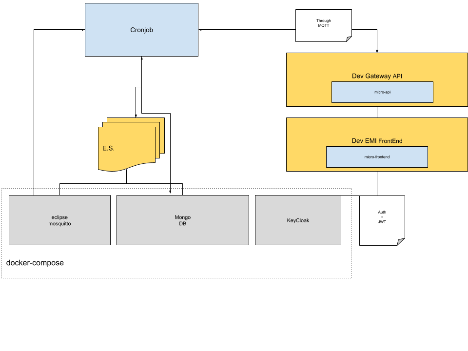
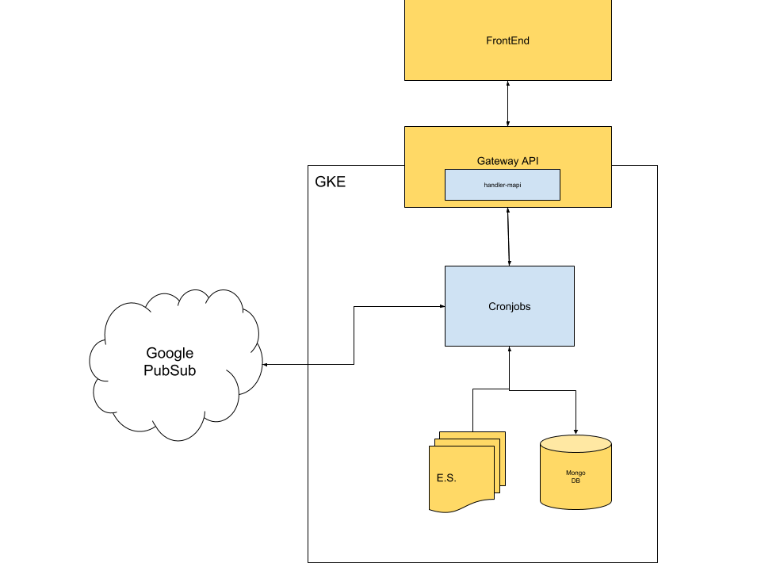

# Cronjob MicroService
The general purpose of this service is manage (Create, update, remove, query and execute the jobs) the jobs required by the platform.
This process is handle by three subprocess:
 * device backend: Here is executed all active jobs registered in materialized view, additonally the CRUD of the materialized view is realized.  
 * device api: this service is a bridge between the backend and the frontend, this api use the [Apollo Graphql api](https://www.apollographql.com/docs/apollo-server/), here is hosted the Queries and the subscribtions consumed by the frontend.

 * device frontend: show the stored info of cronjobs using a client-side aplication based on 
 [Angular core](https://angular.io/) as the basis of the project and [Angular material](https://material.angular.io/) as a visual framework. 

 _This MicroService is built on top of NebulaE MicroService Framework.  Please see the [FrameWork project](https://github.com/NebulaEngineering/nebulae) to understand the full concept_**.

 

 # Table of Contents
  * [Project Structure](#structure)
  * [FrontEnd](#frontend) - not yet available  
    *  [Environment variables](#frontend_env_vars) - not yet available  
  * [API](#api)
    * [GraphQL throught EMI Gateway API](#api_emi_gateway_graphql)
  * [BackEnd](#backend)
    *  [Devices](#backend_cronjob)
        *  [Environment variables](#backend_cronjob_env_vars)
        *  [Event Sourcing](#backend_cronjob_eventsourcing)    
  * [Prepare development environment](#prepare_dev_env)
  * [License](#license)

# Project structure <a name="structure"></a>

```
.
├── frontend                            => Micro-FrontEnds - not yet available  
│   └── emi                             => Micro-FrontEnd for [EMI FrontEnd](https://github.com/nebulae-pyxis/emi) - not yet available  
├── api                                 => Micro-APIs  
│   └── emi-gateway                     => Micro-API for [EMI Gateway API](https://github.com/nebulae-pyxis/emi-gateway)  
├── backend                             => Micro-BackEnds  
│   ├── cronjob                         => Micro-BackEnd responsible for store and execute jobs 
├── etc                                 => Micro-Service config Files.  
├── deployment                          => Automatic deployment strategies  
│   ├── compose                         => Docker-Compose environment for local development  
│   └── gke                             => Google Kubernetes Engine deployment file descriptors  
│   └── mapi-setup.json                 => Micro-API setup file  
├── .circleci                           => CircleCI v2. config directory
│   ├── config.yml
│   └── scripts
├── docs                                => Documentation resources  
│   └── images  
├── README.md                           => This doc
```

# API <a name="api"></a>
Exposed interfaces to send Commands and Queries by the CQRS principles.  
The MicroService exposes its interfaces as Micro-APIs that are nested on the general API. 

## GraphQL throught EMI Gateway API <a name="api_emi_gateway_graphql"></a>
These are the exposed GraphQL functions throught the [EMI Gateway API](https://github.com/nebulae-pyxis/emi-gateway). 

Note: You may find the GraphQL schema [here](api/emi-gateway/graphql/devices/schema.gql)

### Queries

#### getCronjobDetail
Get Cronjob filtered by the cronjob id

#### getCronjobs
Get a list of Cronjobs limited by page and count

#### getCronjobTableSize
Get the size of table Cronjob

### Mutations

#### persistCronjob
Create a new cronjob

#### updateCronjob
update a cronjob filtered by id

#### removeCronjob
remove a cronjob filtered by id

#### executeCronjob
execute a cronjob manually filtered by id

### Subscriptions

#### CronjobRegistersUpdated
Identify when a cronjob has been updated and notify listeners

# BackEnd <a name="backend"></a>
Backends are defined processes within a docker container.  
Each process is responsible to build, run and maintain itself.  

Each BackEnd has the following running commands:
  * npm start: executes main program
  * npm run prepare: execute maintenance routines such DB indexes creation
  * npm run sync-state:  syncs backend state by reading all missing Events from the event-store
  * npm test: runs unit tests

## Cronjob <a name="backend_cronjob"></a>
 Here is executed all active jobs registered in materialized view, additonally the CRUD of the materialized view is realized.

### Environment variables <a name="backend_cronjob_env_vars"></a>

```
+------------------------------------------+--------+----------------------------------------------------------------------------------------------+-------+-----------+
|                 VARIABLE                 | TYPE   |                                          DESCRIPTION                                         |  DEF. | MANDATORY |
|                                          |        |                                                                                              | VALUE |           |
+------------------------------------------+--------+----------------------------------------------------------------------------------------------+-------+-----------+
| production                               | bool   | Production enviroment flag                                                                   | false |           |
+------------------------------------------+--------+----------------------------------------------------------------------------------------------+-------+-----------+
| EVENT_STORE_BROKER_TYPE                  | enum   | Event store broker type to use.                                                              |       |     X     |
|                                          | string | Ops: PUBSUB, MQTT                                                                            |       |           |
+------------------------------------------+--------+----------------------------------------------------------------------------------------------+-------+-----------+
| EVENT_STORE_BROKER_EVENTS_TOPIC          | enum   | Event store topic's name.                                                                    |       |     X     |
|                                          | string |                                                                                              |       |           |
+------------------------------------------+--------+----------------------------------------------------------------------------------------------+-------+-----------+
| EVENT_STORE_STORE_TYPE                   | enum   | Event store storage type to use.                                                             |       |     X     |
|                                          | string | Ops: MONGO                                                                                   |       |           |
+------------------------------------------+--------+----------------------------------------------------------------------------------------------+-------+-----------+
| EVENT_STORE_STORE_URL                    | string | Event store storage URL or connection string.                                                |       |     X     |
|                                          |        | Eg.: mongodb://127.0.0.1:27017/test                                                          |       |           |
+------------------------------------------+--------+----------------------------------------------------------------------------------------------+-------+-----------+
| EVENT_STORE_STORE_AGGREGATES_DB_NAME     | string | Event store storage database name for Aggregates                                             |       |     X     |
|                                          |        | Eg.: Aggregates                                                                              |       |           |
+------------------------------------------+--------+----------------------------------------------------------------------------------------------+-------+-----------+
| EVENT_STORE_STORE_EVENTSTORE_DB_NAME     | string | Event store storage database name prefix for Event Sourcing Events                           |       |     X     |
|                                          |        | Eg.: EventStore                                                                              |       |           |
+------------------------------------------+--------+----------------------------------------------------------------------------------------------+-------+-----------+
| GOOGLE_APPLICATION_CREDENTIALS           | string | Production only.                                                                             |       |     X     |
|                                          |        | Google service account key path to access google cloud resources.                            |       |           |
|                                          |        |                                                                                              |       |           |
|                                          |        | Eg.: /etc/GOOGLE_APPLICATION_CREDENTIALS/gcloud-service-key.json                             |       |           |
+------------------------------------------+--------+----------------------------------------------------------------------------------------------+-------+-----------+
| LOCKVERSION                              | string | Production only.                                                                             |       |     X     |
|                                          |        | word or phrase used to evaluate if the sync task should be run before starting this backend. |       |           |
|                                          |        | This value must be changed to force state sync task.                                         |       |           |
+------------------------------------------+--------+----------------------------------------------------------------------------------------------+-------+-----------+
| MONGODB_URL                              | string | Materialized views MONGO DB URL                                                              |       |     X     |
|                                          |        | Eg.: mongodb://127.0.0.1:27017/test                                                          |       |           |
+------------------------------------------+--------+----------------------------------------------------------------------------------------------+-------+-----------+
| MONGODB_DB_NAME                          | string | Materialized views MONGO DB name                                                             |       |     X     |
|                                          |        | Eg.: DevicesReport                                                                           |       |           |
+------------------------------------------+--------+----------------------------------------------------------------------------------------------+-------+-----------+
| JWT_PUBLIC_KEY                           | string | RSA Public key to verify JWT Tokens.                                                         |       |     X     |
|                                          |        | Format: -----BEGIN PUBLIC KEY-----\nPUBLIC_KEY\n-----END PUBLIC KEY-----                     |       |           |
+------------------------------------------+--------+----------------------------------------------------------------------------------------------+-------+-----------+
| REPLY_TIMEOUT                            | number | TimeOut in milliseconds in case of sending data through the broker and waiting the response. |  2000 |           |
+------------------------------------------+--------+----------------------------------------------------------------------------------------------+-------+-----------+
| BROKER_TYPE                              | enum   | Broker type to use for inter-process communication.                                          |       |     X     |
|                                          | string | Ops: PUBSUB, MQTT                                                                            |       |           |
+------------------------------------------+--------+----------------------------------------------------------------------------------------------+-------+-----------+
```

#### Notes: 
  * ENV VARS for development are [here](backend/cronjob/.env)
  * ENV VARS for production are [here](deployment/gke/deployment-cronjob.yaml)

### Event Sourcing <a name="backend_devices_eventsourcing"></a>
Event sourcing events this Micro-BackEnd is subscribed to or is publishing

#### Subscribed events:
  * CronjobCreated
  * CronjobUpdated
  * CronjobRemoved

#### Published events:
  * CronjobCreated
  * CronjobUpdated
  * CronjobRemoved  

# Prepare development environment <a name="prepare_dev_env"></a>



# License <a name="license"></a>

Copyright 2018 Nebula Engineering SAS

Licensed under the Apache License, Version 2.0 (the "License");
you may not use this file except in compliance with the License.
You may obtain a copy of the License at

    http://www.apache.org/licenses/LICENSE-2.0

Unless required by applicable law or agreed to in writing, software
distributed under the License is distributed on an "AS IS" BASIS,
WITHOUT WARRANTIES OR CONDITIONS OF ANY KIND, either express or implied.
See the License for the specific language governing permissions and
limitations under the License.